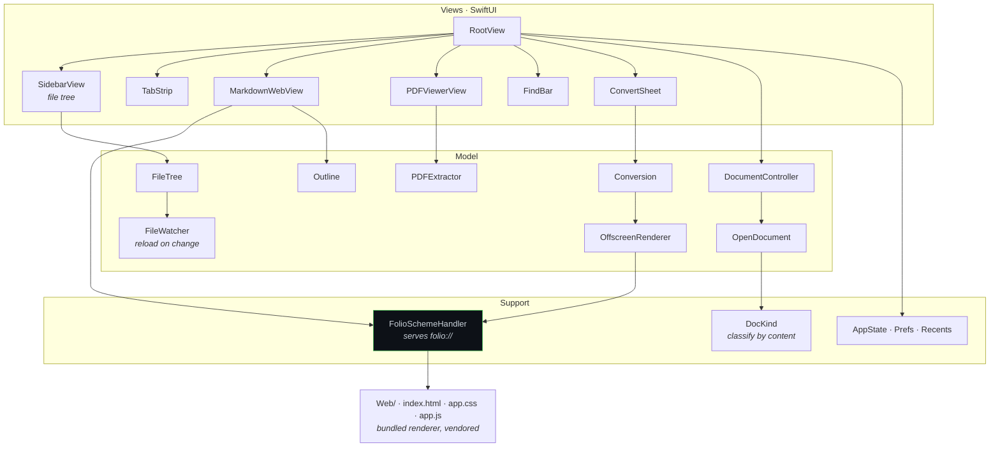
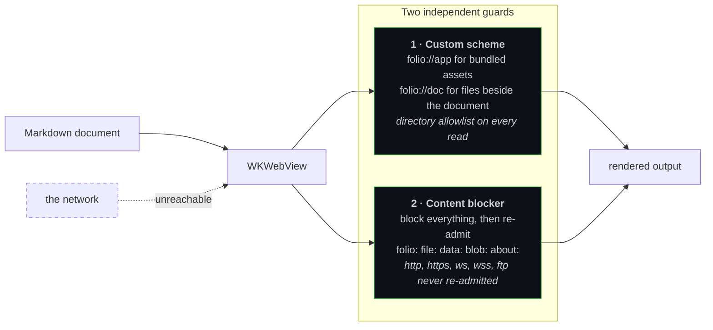

# Folio

A native macOS reader for Markdown and PDF. SwiftUI, Swift 6, macOS 14 and later, no
dependencies outside the system frameworks.

Open a folder, get a file tree and tabs. Markdown renders with an outline and in-document
find; PDFs open in a real PDF view with text extraction. Markdown can be converted and
exported. **Nothing it renders is allowed to touch the network**, and that is enforced rather
than promised.

## Architecture



## The part worth reading the code for

Markdown is rendered in a `WKWebView`, which is the pragmatic choice and also the dangerous
one: a web view will happily fetch remote images, fonts and scripts referenced by a document
you did not write. Folio closes that off twice.



**Why a custom scheme instead of `file://`.** `loadFileURL` grants read access to exactly one
directory tree, and the renderer needs two: its own bundled assets, and the folder the
document lives in so relative image links resolve. Handing WebKit both would have meant
handing it a wider slice of the disk. `FolioSchemeHandler` serves both from one scheme and
checks an explicit directory allowlist on every single read.

**Why the content blocker is tested so heavily.** It once failed silently. The original rule
list used a regex alternation, `^(folio|file|…):`, which WebKit's content-blocker engine
rejects. The list failed to compile, the guard was never installed, and conversion quietly
went back to fetching remote resources — with no error anywhere. `OfflineGuardTests` now
asserts that the JSON parses, that it contains no alternation, that every local scheme is
re-admitted, that no remote scheme is, and, the one that actually matters, **that WebKit
itself compiles the list**.

A security control that fails open and says nothing is worse than no control, because you
stop looking.

## Build and run

```bash
swift build -c release          # build
./Scripts/test.sh               # XCTest suite
./Scripts/build-app.sh          # package Folio.app
./Scripts/mutation-test.py      # mutation testing over the suite
```

Requires macOS 14 or later and a Swift 6 toolchain.

## Tests

| Suite | Covers |
|---|---|
| `OfflineGuardTests` | the content blocker compiles and admits only local schemes |
| `ConversionRulesTests` | conversion rules in isolation |
| `ConversionIntegrationTests` | conversion end to end |
| `PDFExtractorTests` | text extraction from PDF |
| `ClassificationTests` | document kind detection |

The suite is run under mutation testing as well as coverage, because a passing assertion that
would still pass with the logic inverted is not a test.
